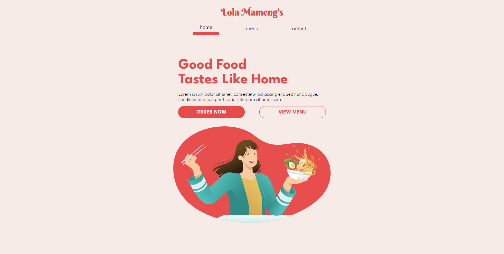

# Restaurant Page

This is a solution to the [Project: Restaurant Page](https://www.theodinproject.com/lessons/node-path-javascript-tic-tac-toe). The [Odin Project](https://www.theodinproject.com/about) provides a free open source coding curriculum that can be taken entirely online. Since its inception, it has helped many students get hired as developers and has assisted countless others in learning enough programming to work on their own personal projects.

## Overview

### The challenge

Dynamically render a Simple Restaurant Page

- Use JS to generate entire contents of the site
- Setup and use webpack
- Use separate modules for each tab/component

### Screenshot

### Links

- Live Site URL: [https://theadg.github.io/restaurant-page/]

## My Process

### Built with

- Semantic HTML5 markup
- CSS custom properties
- BEM Naming Convention
- Mobile-first workflow
- Vanilla JS
- SASS

### What I learned

I have learned how to use and setup Webpack, a free and open-source module bundler for JavaScript. I have also gotten a feel for using npm commands and damn it feels good. I used a "React" approach when creating this project, I created each component in its own JS file and imported it to the main JS file. I have better understanding of manipulating package.json and webpack.config files. Also, I have learned about using SASS loaders, HTML Webpack Plugin and Asset Management using Webpack. I definitely grasp why Webpack exists, and I thank God Almighty for it.

### Continued development

I will be creating a new template repo in Github with Webpack all set up, so that whenever my workflow will be much faster and I won't have to setup everything from the start again. I'll be exploring more node modules to use in my projects. Also, I'll use Webpack's minifier and uglifier for my upcoming projects to optimize my page load.
